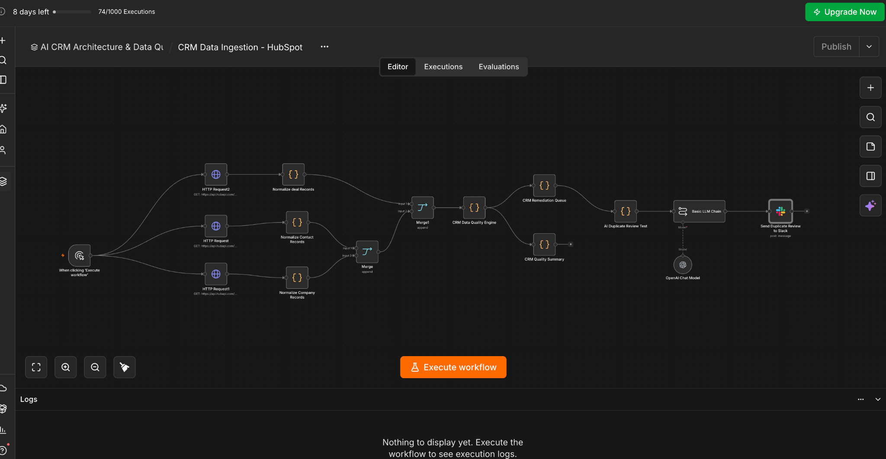
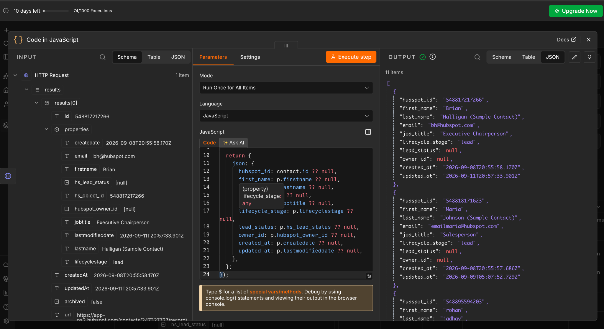
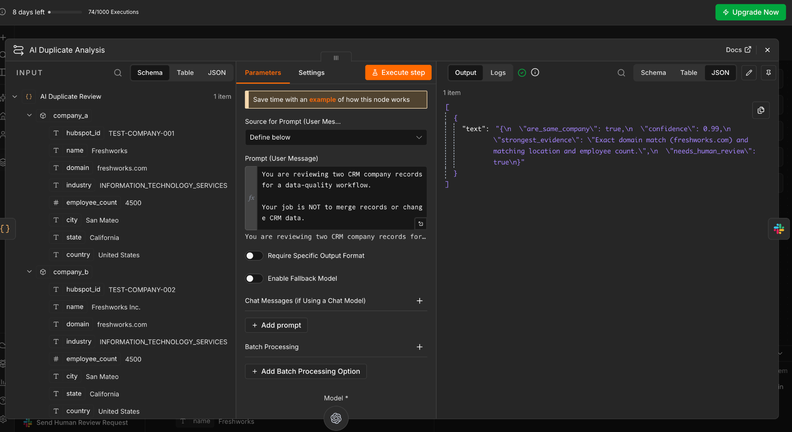
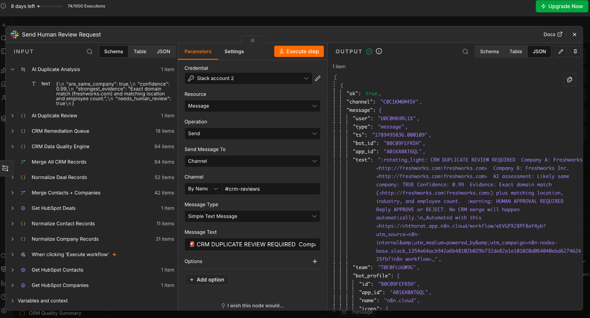
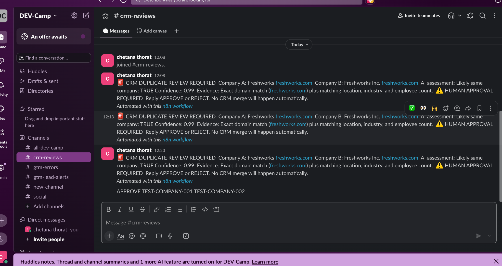
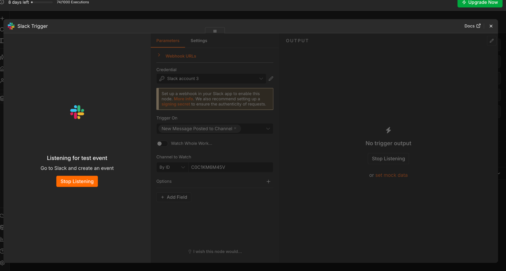

# AI CRM Data Quality & Governance Platform

A lightweight CRM data-quality and governance workflow built with **HubSpot, n8n, JavaScript, OpenAI, and Slack**.

The workflow pulls contacts, companies, and deals from HubSpot, normalizes the API responses, checks the records with deterministic rules, summarizes the CRM health, flags records for corrective action, and uses OpenAI to review ambiguous duplicate-company cases. AI recommendations are sent to Slack for human review instead of being allowed to change CRM data automatically.

## Why I Built It

CRM data becomes difficult to trust when records are incomplete, duplicated, stale, or not consistently owned. Manual review is slow and makes it hard to see which records need attention first.

The project turns that process into a repeatable workflow:

```text
HubSpot
   |
   v
n8n API ingestion
   |
   v
Normalization
   |
   v
CRM Data Quality Engine
   |---- Missing fields
   |---- Duplicate candidates
   |---- Stale activity
   `---- Owner coverage
   |
   v
CRM Quality Summary
   |
   v
Issue review + corrective-action queue
   |
   v
AI Duplicate Review (OpenAI)
   |
   v
Slack human review request
   |
   v
Human approval required before CRM changes
```

## What I Built

- **HubSpot REST API ingestion** for contacts, companies, and deals
- **JavaScript normalization** into a consistent record structure
- A centralized **CRM Data Quality Engine**
- Required-field validation
- Company duplicate detection using normalized domain/name matching
- Deal duplicate-candidate detection using normalized deal names
- Stale-record checks using a **30-day inactivity threshold** when activity data exists
- Separate **owner coverage** measurement
- A **CRM Quality Summary** with issue counts and quality rate
- A structured **issue review / corrective-action queue**
- An **OpenAI duplicate-company review** step with structured evidence and confidence
- A **Slack human-review notification** step

## Baseline Results

The current HubSpot test CRM contains **94 records**:

| Metric | Result |
|---|---:|
| Contacts | 11 |
| Companies | 31 |
| Deals | 52 |
| Total records checked | 94 |
| Valid records | 83 |
| Invalid records | 11 |
| Data quality rate | **88.3%** |
| Records missing owner | 94 |
| Owner coverage | **0%** |
| Duplicate deal candidates | 4 |
| Missing deal amounts | 1 |
| Missing company names | 6 |
| Missing company countries | 7 |

The **88.3%** value is a baseline for the current test CRM state. It is not presented as a production benchmark.

## How the Workflow Works

### 1. Ingest HubSpot data

Three REST API branches retrieve:

- Contacts
- Companies
- Deals

### 2. Normalize the API responses

Each object type is converted into a predictable structure with fields such as:

```text
record_type
hubspot_id
name / deal_name
lifecycle_stage / deal_stage
owner_id
created_at
updated_at
last_activity_at
```

This keeps the quality rules independent of the raw HubSpot response shape.

### 3. Run deterministic quality checks

A single **CRM Data Quality Engine** evaluates the normalized records.

#### Missing fields

Required fields vary by object:

- Contact: first name, last name, email, lifecycle stage
- Company: name, domain, country
- Deal: deal name, amount, deal stage, close date

#### Duplicate candidates

Companies use normalized domain and company-name matching. Deals use normalized deal names.

#### Stale activity

A record is considered stale when a valid last-activity timestamp exists and is more than **30 days** old. Missing activity is not automatically treated as stale.

#### Owner coverage

Missing owners are tracked separately so an unowned record does not automatically become an invalid record. This keeps **data integrity** and **ownership coverage** as separate CRM health measures.

### 4. Summarize CRM health

The **CRM Quality Summary** calculates:

- records checked
- valid / invalid records
- high / medium severity counts
- issue counts by type
- owner coverage
- overall data-quality rate

### 5. Flag issues for corrective action

The workflow converts quality findings into actionable review items containing:

```text
HubSpot record ID
record type
issue type
recommended action
review requirement
status
reason
```

Example:

```text
MISSING_NAME
    -> ENRICH_COMPANY_NAME
    -> REVIEW_REQUIRED
```

### 6. Add AI-assisted duplicate review

For an ambiguous company duplicate case, OpenAI receives structured company records and compares signals such as:

- domain
- company name
- location
- industry
- employee count

The model returns structured output containing:

- duplicate recommendation
- confidence
- supporting evidence
- human-review requirement

The controlled duplicate-review flow produced **0.99 confidence** with explainable evidence and explicitly required human review.

### 7. Human-in-the-loop review

The AI recommendation is sent to a Slack review channel.

The workflow does **not** automatically merge, delete, or overwrite CRM records from the AI recommendation.

```text
Duplicate candidate
      |
      v
OpenAI review
      |
      v
Evidence + confidence
      |
      v
Slack review request
      |
      v
Human approval required
```

This keeps deterministic detection, AI recommendation, and human decision-making separate.

## Screenshots

### Final n8n workflow



The final workflow shows HubSpot ingestion, normalization, the centralized quality engine, summary metrics, the corrective-action queue, AI review, and Slack review.

### HubSpot API normalization



The normalization step converts the raw HubSpot response into a consistent CRM record structure.

### OpenAI duplicate analysis



The AI step compares structured company information and returns an explainable duplicate recommendation.

### Slack human-review request



The n8n Slack node sends the AI recommendation and evidence to the review channel.

### Slack review message



The review message shows the duplicate recommendation, confidence, evidence, and explicit human-approval requirement.

### Slack trigger setup



The Slack event listener was also validated as a separate approval-path proof of concept. The final portfolio scope intentionally stops at the human-review boundary rather than building a full production merge service.

## Workflow Walkthrough Video

A short screenshot-based walkthrough is included here:

[Open workflow walkthrough video](docs/video/workflow-walkthrough.mp4)

The video is a portfolio walkthrough assembled from the captured workflow screens; it is not a raw screen recording.

## Tech Stack

- **CRM:** HubSpot
- **Workflow automation:** n8n
- **Programming:** JavaScript
- **AI:** OpenAI
- **Human review / notifications:** Slack
- **Integration:** REST APIs, webhooks

## Project Scope

This project intentionally focuses on **CRM data quality, governance, and AI-assisted review** rather than becoming a full CRM administration platform.

Implemented scope:

```text
HubSpot
  -> API ingestion
  -> normalization
  -> deterministic quality checks
  -> quality summary
  -> issue review / corrective-action queue
  -> AI-assisted duplicate review
  -> Slack human review
```

Not included in the final portfolio scope:

- automatic CRM merges
- automatic record deletion
- autonomous AI CRM updates
- production-scale approval service
- production database / backend service

These boundaries keep the project simple, explainable, and safe while still demonstrating CRM data engineering, GTM/RevOps workflows, AI review, and human-in-the-loop governance.

## Resume Version

### AI CRM Data Quality & Governance Platform

**Tech Stack:** HubSpot, n8n, JavaScript, OpenAI, Slack, REST APIs, Webhooks

- **Built a HubSpot-to-n8n CRM data pipeline** to replace manual data-quality checks across contacts, companies, and deals, using **REST APIs and JavaScript normalization** to process **94 records** through repeatable validation rules and establish an **88.3% baseline data-quality rate**.
- **Built a centralized CRM data-quality engine** to identify **missing and duplicate records**, checking required fields and duplicate candidates and **flagging issues for review and corrective action**, identifying **11 invalid records** including **6 missing company names, 7 missing countries, 1 missing deal amount, and 4 duplicate deal candidates**.
- **Added CRM health and governance checks** for **stale activity, lifecycle/stage values, and record ownership**, using a **30-day inactivity threshold** and separate ownership metrics to distinguish data-quality issues from coverage gaps, revealing **0% owner coverage across 94 records**.
- **Built an OpenAI-powered duplicate-company review flow** that compared **company domains, names, locations, industries, and employee counts** and returned a **structured duplicate decision, confidence score, and supporting evidence**, producing **0.99 confidence with explainable evidence** for human review.
- **Added human-in-the-loop controls** by sending AI duplicate recommendations and supporting evidence to **Slack** and requiring **human approval before any CRM merge or update**, keeping AI recommendations separate from the deterministic quality engine.

## Security Notes

Do not commit:

- HubSpot access tokens
- OpenAI API keys
- Slack tokens or signing secrets
- private CRM exports containing sensitive information

Use environment variables or n8n-managed credentials for secrets.

## Portfolio Review

See [`docs/PROJECT_REVIEW.md`](docs/PROJECT_REVIEW.md) for the final architecture review, strengths, limitations, and recruiter-facing project summary.
