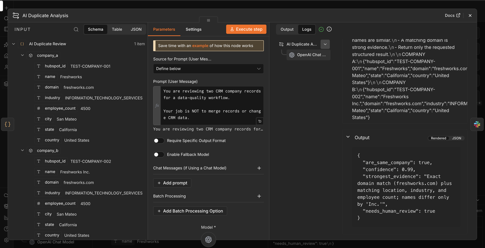
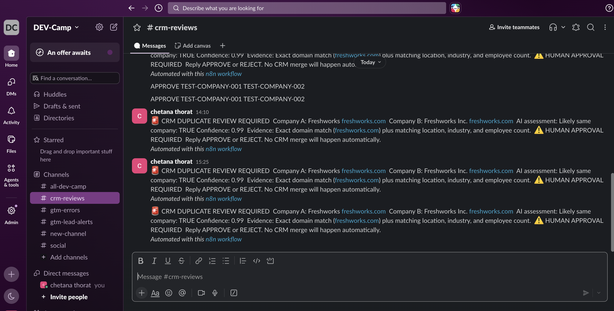

# AI CRM Data Quality & Governance Platform

A lightweight CRM data-quality and governance workflow built with **HubSpot, n8n, JavaScript, OpenAI, and Slack**.

The workflow pulls contacts, companies, and deals from HubSpot, normalizes the API responses, checks the records with deterministic rules, summarizes CRM health, flags records for corrective action, and uses OpenAI to review ambiguous duplicate-company cases. AI recommendations are sent to Slack for human review instead of being allowed to change CRM data automatically.

## Why I Built It

CRM data becomes difficult to trust when records are incomplete, duplicated, stale, or not consistently owned. Manual review is slow and makes it hard to see which records need attention first.

The project turns that process into a repeatable workflow:

```text
HubSpot
   |
   v
n8n API ingestion
   |
   v
Normalization
   |
   v
CRM Data Quality Engine
   |---- Missing fields
   |---- Duplicate candidates
   |---- Stale activity
   `---- Owner coverage
   |
   v
CRM Quality Summary
   |
   v
Issue review + corrective-action queue
   |
   v
AI Duplicate Review (OpenAI)
   |
   v
Slack human review request
   |
   v
Human approval required before CRM changes
```

## What I Built

- **HubSpot REST API ingestion** for contacts, companies, and deals
- **JavaScript normalization** into a consistent record structure
- A centralized **CRM Data Quality Engine**
- Required-field validation
- Company duplicate detection using normalized domain/name matching
- Deal duplicate-candidate detection using normalized deal names
- Stale-record checks using a **30-day inactivity threshold** when activity data exists
- Separate **owner coverage** measurement
- A **CRM Quality Summary** with issue counts and quality rate
- A structured **issue review / corrective-action queue**
- An **OpenAI duplicate-company review** step with structured evidence and confidence
- A **Slack human-review notification** step

## Baseline Results

The current HubSpot test CRM contains **94 records**:

| Metric | Result |
|---|---:|
| Contacts | 11 |
| Companies | 31 |
| Deals | 52 |
| Total records checked | 94 |
| Valid records | 83 |
| Invalid records | 11 |
| Data quality rate | **88.3%** |
| Records missing owner | 94 |
| Owner coverage | **0%** |
| Duplicate deal candidates | 4 |
| Missing deal amounts | 1 |
| Missing company names | 6 |
| Missing company countries | 7 |

The **88.3%** value is a baseline for the current test CRM state. It is not presented as a production benchmark.

## How the Workflow Works

### 1. Ingest HubSpot Data

Three REST API branches retrieve:

- Contacts
- Companies
- Deals

Each API response is passed into a normalization step before quality validation.

### 2. Normalize the API Responses

Each object type is converted into a predictable structure with fields such as:

```text
record_type
hubspot_id
name / deal_name
lifecycle_stage / deal_stage
owner_id
created_at
updated_at
last_activity_at
```

This keeps the quality rules independent of the raw HubSpot response shape.

### 3. Run Deterministic Quality Checks

A single **CRM Data Quality Engine** evaluates the normalized records.

#### Missing Fields

Required fields vary by object.

**Contacts**

```text
first_name
last_name
email
lifecycle_stage
```

**Companies**

```text
name
domain
country
```

**Deals**

```text
deal_name
amount
deal_stage
close_date
```

A missing field becomes a structured quality finding.

Example:

```json
{
  "issue": "MISSING_AMOUNT",
  "record_type": "deal"
}
```

#### Duplicate Candidates

Companies are checked using:

- Normalized company domain
- Normalized company name

For example:

```text
Freshworks
freshworks.com
```

and:

```text
Freshworks Inc.
freshworks.com
```

share the same normalized domain and become duplicate candidates.

Deals are checked using normalized deal names.

The workflow does not automatically merge CRM records.

#### Stale Activity

A record is considered stale when a valid last-activity timestamp exists and is more than **30 days** old.

The workflow distinguishes between:

```text
ACTIVE
STALE
NO_ACTIVITY_DATA
```

Missing activity data is not automatically treated as stale.

#### Owner Coverage

Missing owners are tracked separately so an unowned record does not automatically become an invalid record.

The workflow measures:

```text
records_with_owner
records_missing_owner
owner_coverage_rate
```

This keeps **data integrity** and **ownership coverage** as separate CRM health measures.

### 4. Summarize CRM Health

The **CRM Quality Summary** calculates:

- Records checked
- Valid / invalid records
- Severity counts
- Issue counts by type
- Owner coverage
- Overall data-quality rate

### 5. Flag Issues for Corrective Action

The workflow converts quality findings into structured review items containing:

```text
HubSpot record ID
record type
issue type
recommended action
review requirement
status
reason
```

Example:

```text
MISSING_NAME
    -> ENRICH_COMPANY_NAME
    -> REVIEW_REQUIRED
```

Another example:

```text
DUPLICATE_DEAL_CANDIDATE
    -> REVIEW_DUPLICATE_DEAL
    -> REVIEW_REQUIRED
```

The workflow does not blindly change CRM data when the correct value cannot be determined safely.

### 6. Add AI-Assisted Duplicate Review

For an ambiguous company duplicate case, OpenAI receives structured company records and compares signals such as:

- Domain
- Company name
- Location
- Industry
- Employee count

The model returns structured output containing:

- Duplicate recommendation
- Confidence
- Supporting evidence
- Human-review requirement

Example:

```json
{
  "likely_same_company": true,
  "confidence": 0.99,
  "strongest_evidence": "Exact domain match plus matching location, industry, and employee count.",
  "needs_human_review": true
}
```

The AI is used for **recommendation and explanation**, not for autonomous CRM modification.

### 7. Human-in-the-Loop Review

The AI recommendation is sent to a Slack review channel.

Example:

```text
CRM DUPLICATE REVIEW REQUIRED

Company A:
Freshworks
freshworks.com

Company B:
Freshworks Inc.
freshworks.com

AI assessment:
Likely same company: TRUE
Confidence: 0.99

Evidence:
Exact domain match plus matching location,
industry, and employee count.

HUMAN APPROVAL REQUIRED

No CRM merge will happen automatically.
```

The workflow stops at the human-review boundary.

```text
Duplicate candidate
      |
      v
OpenAI review
      |
      v
Evidence + confidence
      |
      v
Slack review request
      |
      v
Human approval required
```

This keeps deterministic detection, AI recommendation, and human decision-making separate.

## Technical Challenges

### Challenge 1 — Different HubSpot Object Structures

Contacts, companies, and deals expose different fields.

**Solution:**  
Each object type receives its own normalization step while adding a shared:

```text
record_type
```

This allows one centralized quality engine to process all three object types.

### Challenge 2 — Missing Activity Data

Initially, records with no activity timestamp could be incorrectly interpreted as stale.

**Solution:**  
The workflow now distinguishes:

```text
ACTIVE
STALE
NO_ACTIVITY_DATA
```

Only records with known activity older than 30 days are marked stale.

### Challenge 3 — Missing Ownership

Initially, missing ownership could make every record look invalid.

Because the test CRM contains many unowned records, this would have distorted the overall quality score.

**Solution:**  
Owner coverage is tracked separately from record validity.

```text
owner_missing
owner_coverage_rate
```

This allows CRM integrity and ownership coverage to be measured independently.

### Challenge 4 — Duplicate Detection

Company names can appear in different forms:

```text
Freshworks
Freshworks Inc.
Freshworks LLC
```

**Solution:**  
Company names and domains are normalized before comparison so formatting differences do not hide duplicate candidates.

### Challenge 5 — AI Governance

An AI model can make an incorrect recommendation.

Allowing an AI model to directly merge or overwrite CRM records would create unnecessary risk.

**Solution:**  
The AI returns:

```text
decision
confidence
evidence
human-review requirement
```

The recommendation is then sent to Slack for human review.

## Why the Architecture Uses Deterministic Rules + AI

The project deliberately separates responsibilities.

### Deterministic Logic

Used for:

```text
Required-field validation
Duplicate matching
Stale thresholds
Lifecycle / stage checks
Owner coverage
```

These checks are predictable and repeatable.

### AI

Used for:

```text
Ambiguous duplicate review
Evidence explanation
Confidence-based recommendation
```

This keeps AI focused on cases where reasoning adds value.

## Results

The current CRM test dataset contains:

```text
94 total CRM records
```

The quality engine produced:

```text
88.3% baseline data-quality rate
83 valid records
11 invalid records
```

Detected issues included:

```text
6 missing company names
7 missing countries
1 missing deal amount
4 duplicate deal candidates
```

Owner coverage was:

```text
0%
```

The AI duplicate-review workflow produced a structured recommendation with:

```text
0.99 confidence
```

along with supporting evidence and an explicit human-review requirement.

## Screenshots

### Final n8n Workflow


### HubSpot API Ingestion and Normalization


### CRM Remediation Queue


### CRM Quality Summary


### OpenAI Duplicate Analysis


### Slack Human-Review Request



### Slack Human-Review Channel



## Workflow Walkthrough Video

<!-- ADD VIDEO / GITHUB VIDEO LINK HERE -->

## Technology Stack

- **CRM:** HubSpot
- **Workflow automation:** n8n
- **Programming:** JavaScript
- **AI:** OpenAI
- **Human review / notifications:** Slack
- **Integration:** REST APIs, Webhooks

## Project Scope

This project focuses on **CRM data quality, governance, and AI-assisted review** rather than becoming a full CRM administration platform.

Implemented scope:

```text
HubSpot
  -> API ingestion
  -> normalization
  -> deterministic quality checks
  -> quality summary
  -> issue review / corrective-action queue
  -> AI-assisted duplicate review
  -> Slack human review
```

The final portfolio scope intentionally does not include:

- Automatic CRM merges
- Automatic record deletion
- Autonomous AI CRM updates
- A production-scale approval service
- A production database or backend service

These boundaries keep the project simple, explainable, and safe while still demonstrating CRM data engineering, GTM/RevOps workflows, AI-assisted review, and human-in-the-loop governance.

## Security Notes

Do not commit:

- HubSpot access tokens
- OpenAI API keys
- Slack tokens or signing secrets
- Private CRM exports containing sensitive information

Use n8n-managed credentials or environment variables for secrets.

## Project Outcome

The completed system provides a repeatable process for monitoring CRM data quality:

```text
Ingest CRM data
      |
      v
Normalize records
      |
      v
Run deterministic quality checks
      |
      v
Measure CRM health
      |
      v
Identify records needing attention
      |
      v
Use AI for ambiguous duplicate review
      |
      v
Send recommendation for human review
```

The result is a CRM workflow that combines:

```text
CRM Data
+
Workflow Automation
+
Data Quality Rules
+
AI-Assisted Review
+
Human Oversight
```

without allowing the AI layer to make uncontrolled CRM changes.
